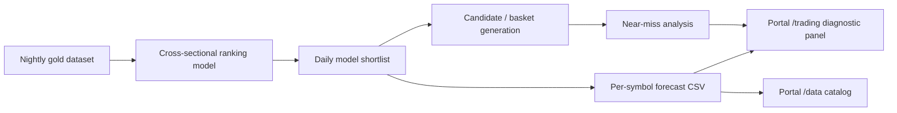

# Per-Symbol Forecast Layer

## Purpose

The per-symbol forecast layer translates the existing shortlist into operator-readable context. It is diagnostic only. It does not loosen thresholds, does not promote candidates, does not write order plans, and does not call any broker or Paper Autopilot submission path.

The ranking model answers: among many names, which symbols rank best right now? This layer answers a different, narrower question: for each shortlisted symbol, what context should the operator see about direction, expected move, liquidity, volatility, and invalidation level?

## Naming Standard

Use `per_symbol_forecast` everywhere.

| Surface | Standard |
| --- | --- |
| Python package | `src/stockml/trading/per_symbol_forecast/` |
| Main script | `scripts/run_per_symbol_forecast.py` |
| Audit script | `scripts/audit_per_symbol_forecast.py` |
| Config | `config/per_symbol_forecast.yaml` |
| CSV artifacts | `data/trading/per_symbol_forecast/per_symbol_forecast_YYYYMMDD_HHMMSS.csv` |
| Audit reports | `reports/per_symbol_forecast_audit/per_symbol_forecast_audit_YYYYMMDD.csv` |
| Portal service | `portal/services/per_symbol_forecast_service.py` |
| Trading panel | `portal/templates/trading/_zones/_per_symbol_forecast.html` |

Avoid plural folder names for this feature. The artifact can contain many rows, but the feature name is singular.

## Pipeline Position

The full nightly pipeline runs the forecast generation after `run_alpaca_paper_trader.py --plan-only`, so the first forecast file is based on the fresh daily candidate pool and order plan before the market day starts.

The synchronized intraday clock runs the forecast generation after candidate refresh and promotion scoring, before rotation recommendations and Paper Autopilot tick. Failure in forecast generation is reported, but it must not create a live trading path.

## Field Tiers

Tier A fields are derived directly from existing inputs. Examples: symbol, side, current trade action, candidate rank, current price, meta-label probability, spread, and intraday range position.

Tier B fields are statistical context. Examples: direction context, direction basis, expected 1-day and 5-day return, expected move in bps, magnitude bucket, downside and upside risk, volatility-adjusted score, penalties, expected profitability score, forecast confirmation, confirmation score, suggested stop and take-profit levels, invalidation level, regime label, and forecast reason.

Direction context is not a calibrated probability. It is derived from candidate side, trade action, or the sign of expected return. Magnitude is bucketed from expected move bps. Expected profitability is an ordinal diagnostic score that combines expected move context with the risk-adjusted forecast score.

Forecast confirmation is also diagnostic only. It classifies each row as `confirmed`, `weak_confirm`, `conflicted`, or `insufficient_data` using side alignment, expected move, profitability, and risk/reward completeness. It is not allowed to open trades directly.

Paper Autopilot may use confirmed per-symbol forecast rows as a controlled fallback source ahead of near-miss rows when `per_symbol_forecast_fallback_enabled` is enabled in the VM-local autopilot config. This does not let the forecast layer submit orders by itself. The row must be fresh, aligned, confirmed, above the configured confirmation and profitability thresholds, and inside the normal auto-open caps, sizing, market-hour, kill-switch, and paper-only controls.

Tier C fields require calibrated predictive models. In the MVP they are present in the schema but intentionally null, with `tier_c_status=uncalibrated`. They must not be filled by scaling ranking scores into pseudo-probabilities.

## Safety Contract

The layer must:

- Write only append-only files under `data/trading/per_symbol_forecast/`.
- Keep `diagnostic_only=true` on every output row.
- Render a visible diagnostic-only warning in the portal.
- Leave shortlist, order plan, near-miss, positions, and autopilot state files untouched.
- Avoid imports containing `alpaca`, `broker`, `submit_order`, or `autopilot` inside the forecast package.

The layer must not:

- Submit broker orders.
- Promote rejected candidates.
- Change thresholds.
- Modify Paper Autopilot state or order logic.
- Become an alternate order planner.

## Rollout

MVP ships Tier A and Tier B only, plus a baseline audit artifact. The audit is initially marked `awaiting_realized_outcomes`. Later versions can compute realized correlations once enough forecast history exists.

Tier C should only be populated after a calibrated classifier is trained and validated on holdout data. Until then the portal displays blank model probability fields.
